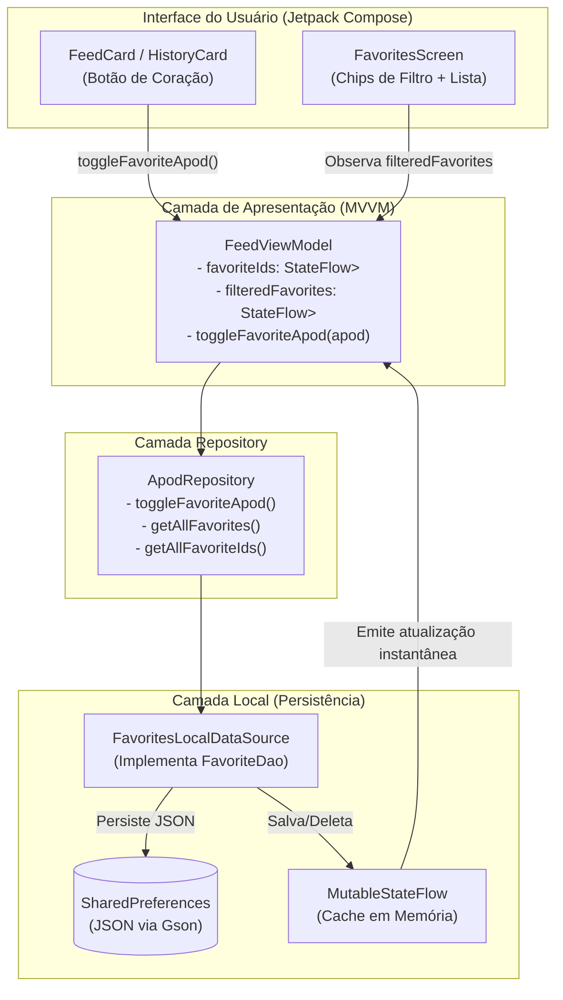

# Arquitetura e Implementação da Funcionalidade de Favoritos - GalaxIA

Este documento descreve detalhadamente a arquitetura de persistência, a modelagem dos dados e as decisões de implementação da funcionalidade de **Favoritos** no aplicativo **GalaxIA**.

---

## 1. Visão Geral da Funcionalidade

A funcionalidade de favoritos permite aos usuários:
1. **Salvar e Remover Itens:** Qualquer foto do APOD (seja no Feed principal ou no Calendário de Histórico) pode ser favoritada/desfavoritada instantaneamente ao tocar no ícone de coração.
2. **Feedback Visual Imediato:** O ícone alterna em tempo real entre o estado vazado (`FavoriteBorder` cinza) e o preenchido (`Favorite` ciano).
3. **Aba Dedicada de Favoritos:** Acessível na barra inferior (`selectedTab == 2`), listando os itens salvos com chips de filtro por categoria, cards expansíveis com link HD e um **Empty State** estilizado para quando a lista estiver vazia.

---

## 2. Arquitetura da Persistência Local (O "Banco de Dados")

### 2.1. Escolha de Estrutura: Estratégia A (Tabela Unificada / Polimórfica)
Optou-se por um modelo de dados unificado (`FavoriteEntity`), capaz de armazenar diferentes categorias de conteúdo sem a necessidade de criar tabelas ou arquivos de persistência separados no futuro.

* **Categorias Suportadas (`FavoriteType`):**
  * `APOD`: Fotos astronômicas do dia (ativo hoje).
  * `NEWS`: Notícias espaciais (preparado para fases futuras).
  * `CURIOSITY`: Curiosidades do cosmos (preparado para fases futuras).

### 2.2. Por que Metadados + URLs (Sem download de binários pesados)?
* **Preservação de Cota da NASA:** Salvar os metadados (título, texto, data, copyright) evita disparar novas requisições à API da NASA para carregar a tela de favoritos, prevenindo o erro HTTP 429 (`DEMO_KEY`).
* **Cache Inteligente de Imagens via Coil 3:** O aplicativo já utiliza a biblioteca Coil 3. O Coil realiza o cache em disco e em memória automaticamente. Como o usuário já visualizou a foto no Feed ou no Histórico ao favoritá-la, a imagem já se encontra em cache local no aparelho, garantindo abertura instantânea e consumo mínimo de armazenamento.

---

## 3. Mecanismo de Armazenamento: `FavoritesLocalDataSource`

Inicialmente avaliou-se o uso do Room com o plugin KSP. No entanto, devido à dependência rígida de versões do KSP em relação ao compilador Kotlin, adotou-se uma solução limpa, nativa e resiliente utilizando **`SharedPreferences` + `Gson`**:

1. **Persistência em Disco:** O objeto de favoritos é serializado em JSON e armazenado em um arquivo de preferências seguro (`galaxia_favorites_prefs`).
2. **Reatividade em Tempo Real:** O `FavoritesLocalDataSource` mantém em memória um `MutableStateFlow<List<FavoriteEntity>>`. Qualquer inclusão ou exclusão notifica automaticamente a interface, dispensando consultas manuais de atualização.
3. **Desacoplamento por Interface:** O `FavoritesLocalDataSource` implementa a interface `FavoriteDao`, permitindo que, caso o projeto deseje migrar para SQLite ou Room no futuro, nenhuma classe de ViewModel ou UI precise ser alterada.

---

## 4. Fluxo de Dados Ponta a Ponta



---

## 5. Estrutura dos Arquivos Criados e Modificados

| Camada | Arquivo | Responsabilidade |
| :--- | :--- | :--- |
| **Local** | [`FavoriteType.kt`] | Enum com as categorias de favoritos e seus títulos de exibição. |
| **Local** | [`FavoriteEntity.kt`] | Data class com os campos do favorito e funções de conversão (`toFavoriteEntity()`, `toApodResponse()`). |
| **Local** | [`FavoriteDao.kt`] | Interface que define os contratos de consulta e escrita dos favoritos. |
| **Local** | [`FavoritesLocalDataSource.kt`] | Implementação concreta da persistência usando `SharedPreferences`, `Gson` e `MutableStateFlow`. |
| **Local** | [`AppDatabase.kt`] | Provedor singleton do `FavoriteDao`. |
| **Global** | [`GalaxiaApplication.kt`] | Provê o `Context` global seguro para inicializar repositórios e banco local. |
| **Global** | [`AndroidManifest.xml`] | Registro da classe de aplicação personalizada (`android:name=".GalaxiaApplication"`). |
| **Repository** | [`ApodRepository.kt`] | Orquestra chamadas de rede da NASA e operações locais de favoritos. |
| **ViewModel** | [`FeedViewModel.kt`] | Gerencia a lista filtrada, filtro ativo e conjunto de IDs favoritados com tempo de resposta O(1). |
| **UI** | [`FavoritesScreen.kt`] | Tela com visual cósmico, filtro por chips, lista expansível de favoritos e Empty State. |
| **UI** | [`FeedScreen.kt`] | Aba 2 conectada aos favoritos e cards do feed com botão de coração dinâmico. |
| **UI** | [`HistoryScreen.kt`] | Integração do card do histórico com o mesmo fluxo de favoritos. |

---

## 6. Como Expandir para Notícias e Curiosidades Futuras

1. **Criar a função de mapeamento:**
   ```kotlin
   fun NewsItem.toFavoriteEntity(): FavoriteEntity = FavoriteEntity(
       id = "news_${this.id}",
       itemType = FavoriteType.NEWS.name,
       title = this.headline,
       subtitleOrDate = this.publishedDate,
       explanationOrBody = this.summary,
       imageUrl = this.bannerUrl,
       extraUrl = this.newsSourceUrl
   )
   ```
2. **Favoritar pelo ViewModel:**
   Basta chamar `favoriteDao.insertFavorite(newsItem.toFavoriteEntity())`.
3. **Resultado Automático:**
   O item aparecerá na tela de favoritos instantaneamente, com o chip de filtro `"Notícias"` já funcionando!
