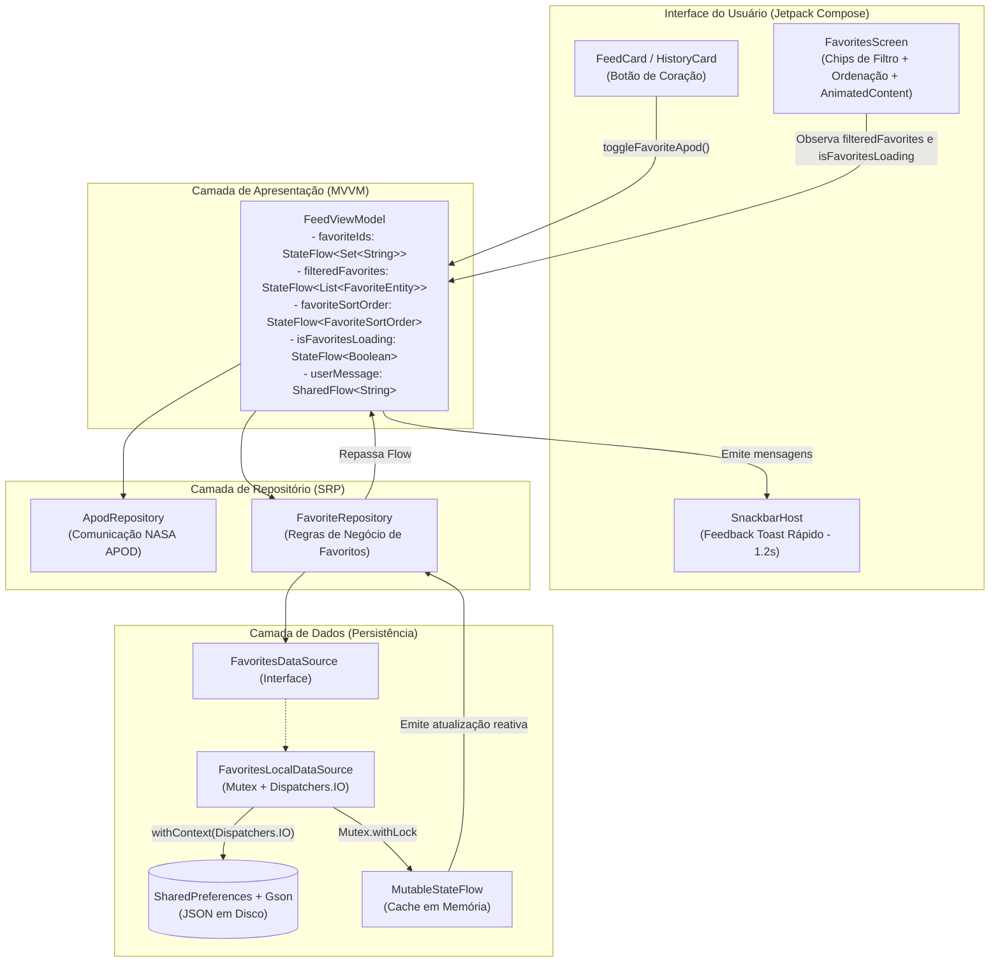

# Arquitetura e Implementação da Funcionalidade de Favoritos - GalaxIA

Este documento descreve detalhadamente a arquitetura de persistência, a modelagem dos dados, as decisões técnicas e as melhorias de experiência de usuário (UX) da funcionalidade de **Favoritos** no aplicativo **GalaxIA**.

---

## 1. Visão Geral da Funcionalidade

A funcionalidade de favoritos permite aos usuários:
1. **Salvar e Remover Itens:** Qualquer foto do APOD (seja no Feed principal ou no Calendário de Histórico) pode ser favoritada/desfavoritada instantaneamente ao tocar no ícone de coração.
2. **Feedback Visual e Informativo:** 
   - O ícone alterna em tempo real entre o estado vazado (`FavoriteBorder` cinza) e o preenchido (`Favorite` ciano).
   - Uma mensagem informativa tipo toast/snackbar ("*Foto adicionada aos favoritos*" ou "*Foto removida dos favoritos*") é exibida com temporização rápida e dinâmica (**1.2s**), evitando acúmulo de mensagens.
3. **Aba Dedicada de Favoritos:** Acessível na barra inferior (`selectedTab == 2`), oferecendo:
   - **Filtros por Categoria:** Alterna entre *Todos*, *Fotos do Dia*, *Notícias* e *Curiosidades*.
   - **Ordenação Dinâmica:** Ordena por data da publicação da foto (*Mais recentes* por padrão e *Mais antigos*), além de ordem alfabética de título (*A-Z*).
   - **Atualização Instantânea e Responsiva:** Transição suave com `AnimatedContent`, reset automático de rolagem para o topo (`scrollToItem(0)`) e chaves compostas no `LazyColumn`, dispensando qualquer necessidade de deslizar a tela manualmente para visualizar novos itens.
   - **Cards Expansíveis:** Leitura da explicação completa e botão para abertura da foto em resolução original (HD) no navegador.
   - **Empty State:** Layout amigável quando nenhum item corresponde aos filtros selecionados.

---

## 2. Arquitetura da Persistência Local

### 2.1. Modelagem Unificada (`FavoriteEntity`)
Optou-se por um modelo de dados polimórfico (`FavoriteEntity`), capaz de representar itens de qualquer categoria de conteúdo do GalaxIA com uma estrutura única e extensível:

* **Categorias Suportadas (`FavoriteType`):**
  * `APOD`: Fotos astronômicas do dia da NASA.
  * `NEWS`: Notícias espaciais (preparado para fases futuras).
  * `CURIOSITY`: Curiosidades astronômicas (preparado para fases futuras).

* **Critérios de Ordenação (`FavoriteSortOrder`):**
  * `NEWEST`: Ordena decrescente pela data da publicação do conteúdo (`subtitleOrDate`).
  * `OLDEST`: Ordena crescente pela data da publicação do conteúdo (`subtitleOrDate`).
  * `ALPHABETICAL`: Ordena alfabeticamente pelo título (`title`).

### 2.2. Estratégia de Imagens e Resiliência de Cache
* **Metadados + URLs Persistidos:** O aplicativo persiste os metadados textuais e a URL da imagem. Não são gravados binários pesados de imagens diretamente no armazenamento privado, prevenindo saturação de espaço no aparelho e evitando novas requisições desnecessárias à API da NASA.
* **Cache HTTP via Coil 3:** O Coil gerencia o cache em memória e em disco. Caso o cache seja limpo pelo sistema operacional ou pelo usuário, o aplicativo baixa a imagem novamente em segundo plano de forma transparente.
* **Placeholder Cósmico:** Durante o carregamento da imagem ou caso o dispositivo esteja offline e a imagem não esteja no cache, um background escuro estilizado (`#161822`) é exibido, evitando buracos visuais na interface.

---

## 3. Mecanismo de Armazenamento: `FavoritesLocalDataSource`

Para evitar incompatibilidades do compilador KSP no **Kotlin 2.4 / AGP 9.4**, adotou-se uma implementação limpa e robusta utilizando **`SharedPreferences` + `Gson`**:

1. **Desacoplamento por Interface:** A fonte de dados implementa a interface `FavoritesDataSource` (com `FavoriteDao` mantido como alias anotado com `@Deprecated` para compatibilidade reversa).
2. **Segurança de Concorrência (Thread Safety):** 
   - Uso de `Mutex` com `withLock` para sincronizar operações de inserção e remoção, prevenindo inconsistências em cliques múltiplos ou simultâneos.
   - Serialização e gravação em disco despachadas para `Dispatchers.IO` via `withContext(Dispatchers.IO)`, blindando a UI thread contra engasgos (*drops de frames*).
3. **Reatividade Instantânea:** Mantém em memória um `MutableStateFlow<List<FavoriteEntity>>`, emitindo atualizações instantâneas a cada alteração.

---

## 4. Fluxo de Dados Ponta a Ponta


```mermaid
flowchart TD
    subgraph UI ["Interface do Usuário (Jetpack Compose)"]
        FC["FeedCard / HistoryCard<br/>(Botão de Coração)"]
        FS["FavoritesScreen<br/>(Chips de Filtro + Ordenação + AnimatedContent)"]
        SB["SnackbarHost<br/>(Feedback Toast Rápido - 1.2s)"]
    end

    subgraph VM ["Camada de Apresentação (MVVM)"]
        FVM["FeedViewModel<br/>- favoriteIds: StateFlow&lt;Set&lt;String&gt;&gt;<br/>- filteredFavorites: StateFlow&lt;List&lt;FavoriteEntity&gt;&gt;<br/>- favoriteSortOrder: StateFlow&lt;FavoriteSortOrder&gt;<br/>- isFavoritesLoading: StateFlow&lt;Boolean&gt;<br/>- userMessage: SharedFlow&lt;String&gt;"]
    end

    subgraph REPO ["Camada de Repositório (SRP)"]
        AR["ApodRepository<br/>(Comunicação NASA APOD)"]
        FR["FavoriteRepository<br/>(Regras de Negócio de Favoritos)"]
    end

    subgraph DATA ["Camada de Dados (Persistência)"]
        DS["FavoritesDataSource (Interface)"]
        LDS["FavoritesLocalDataSource<br/>(Mutex + Dispatchers.IO)"]
        SP[("SharedPreferences + Gson<br/>(JSON em Disco)")]
        MEM["MutableStateFlow<br/>(Cache em Memória)"]
    end

    FC -->|"toggleFavoriteApod()"| FVM
    FS -->|"Observa filteredFavorites e isFavoritesLoading"| FVM
    FVM -->|"Emite mensagens"| SB
    FVM --> AR
    FVM --> FR
    FR --> DS
    DS -.-> LDS
    LDS -->|"Mutex.withLock"| MEM
    LDS -->|"withContext(Dispatchers.IO)"| SP
    MEM -->|"Emite atualização reativa"| FR
    FR -->|"Repassa Flow"| FVM
```

---

## 5. Estrutura dos Arquivos da Funcionalidade

| Camada | Arquivo | Responsabilidade |
| :--- | :--- | :--- |
| **Local** | [`FavoritesDataSource.kt`](file:///c:/Users/joaor/Documents/GitHub/GalaxIA/app/src/main/java/com/example/galaxia/data/local/FavoritesDataSource.kt) | Contrato de acesso a dados locais agnóstico de persistência. |
| **Local** | [`FavoriteDao.kt`](file:///c:/Users/joaor/Documents/GitHub/GalaxIA/app/src/main/java/com/example/galaxia/data/local/FavoriteDao.kt) | Alias de compatibilidade com `@Deprecated` apontando para `FavoritesDataSource`. |
| **Local** | [`FavoriteSortOrder.kt`](file:///c:/Users/joaor/Documents/GitHub/GalaxIA/app/src/main/java/com/example/galaxia/data/local/FavoriteSortOrder.kt) | Enum que rege os critérios de ordenação: `NEWEST`, `OLDEST` e `ALPHABETICAL`. |
| **Local** | [`FavoriteType.kt`](file:///c:/Users/joaor/Documents/GitHub/GalaxIA/app/src/main/java/com/example/galaxia/data/local/FavoriteType.kt) | Categorias de conteúdo (`APOD`, `NEWS`, `CURIOSITY`). |
| **Local** | [`FavoriteEntity.kt`](file:///c:/Users/joaor/Documents/GitHub/GalaxIA/app/src/main/java/com/example/galaxia/data/local/FavoriteEntity.kt) | Entidade única de favoritos e extensões de mapeamento (`toFavoriteEntity()`, `toApodResponse()`). |
| **Local** | [`FavoritesLocalDataSource.kt`](file:///c:/Users/joaor/Documents/GitHub/GalaxIA/app/src/main/java/com/example/galaxia/data/local/FavoritesLocalDataSource.kt) | Persistência concreta em SharedPreferences com Gson, Mutex e Dispatchers.IO. |
| **Local** | [`AppDatabase.kt`](file:///c:/Users/joaor/Documents/GitHub/GalaxIA/app/src/main/java/com/example/galaxia/data/local/AppDatabase.kt) | Provedor de acesso centralizado aos recursos locais de dados. |
| **Repository** | [`FavoriteRepository.kt`](file:///c:/Users/joaor/Documents/GitHub/GalaxIA/app/src/main/java/com/example/galaxia/repository/FavoriteRepository.kt) | Repositório dedicado à gestão de favoritos e isolamento da persistência. |
| **Repository** | [`ApodRepository.kt`](file:///c:/Users/joaor/Documents/GitHub/GalaxIA/app/src/main/java/com/example/galaxia/repository/ApodRepository.kt) | Repositório focado exclusivamente na API remota da NASA. |
| **ViewModel** | [`FeedViewModel.kt`](file:///c:/Users/joaor/Documents/GitHub/GalaxIA/app/src/main/java/com/example/galaxia/viewmodel/FeedViewModel.kt) | Orquestra filtros, ordenação por data de publicação, loading de transição e feedback via SharedFlow. |
| **UI** | [`FavoritesScreen.kt`](file:///c:/Users/joaor/Documents/GitHub/GalaxIA/app/src/main/java/com/example/galaxia/ui/favorites/FavoritesScreen.kt) | Interface com chips de categoria e ordenação, `AnimatedContent`, chaves compostas e scroll automático ao topo. |
| **UI** | [`FeedScreen.kt`](file:///c:/Users/joaor/Documents/GitHub/GalaxIA/app/src/main/java/com/example/galaxia/ui/feed/FeedScreen.kt) | `Scaffold` com `SnackbarHost` estilizado, timeout acelerado de 1.2s e botão de favorito no Feed. |
| **UI** | [`HistoryScreen.kt`](file:///c:/Users/joaor/Documents/GitHub/GalaxIA/app/src/main/java/com/example/galaxia/ui/history/HistoryScreen.kt) | Botão de favorito e placeholder escuro de carregamento integrados ao calendário de histórico. |

---

## 6. Como Expandir para Notícias e Curiosidades Futuras

1. **Criar a função de extensão para mapeamento:**
   ```kotlin
   fun NewsItem.toFavoriteEntity(): FavoriteEntity = FavoriteEntity(
       id = "news_${this.id}",
       itemType = FavoriteType.NEWS.name,
       title = this.headline,
       subtitleOrDate = this.publishedDate, // Ex: "2026-10-01"
       explanationOrBody = this.summary,
       imageUrl = this.bannerUrl,
       extraUrl = this.newsSourceUrl,
       savedAtTimestamp = System.currentTimeMillis()
   )
   ```
2. **Favoritar pelo FavoriteRepository:**
   ```kotlin
   favoriteRepository.saveFavoriteItem(newsItem.toFavoriteEntity())
   ```
3. **Resultado Automático:**
   O item aparecerá na tela de favoritos instantaneamente, sendo ordenado pelas datas de publicação em *Mais recentes* ou *Mais antigos*, além de ser filtrado perfeitamente sob o chip `"Notícias"`.
